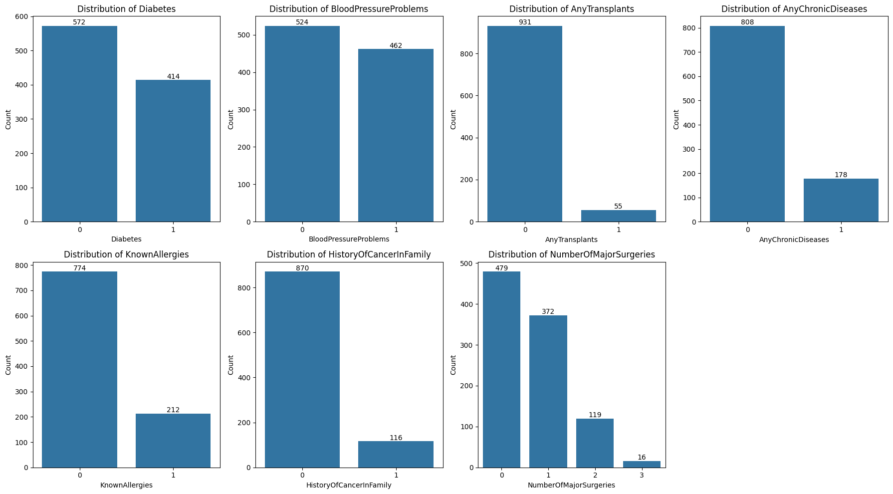
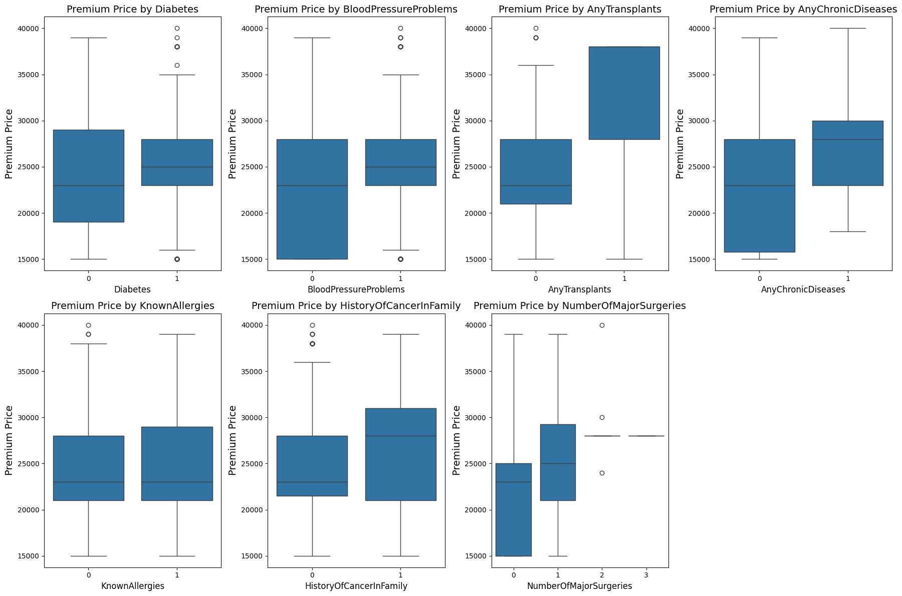

# Problem satement
The goal of this project was to predict insurance premium prices based on customer data, including demographic, medical, and lifestyle attributes. The aim was to assist the insurance company in offering competitive yet profitable premium plans by identifying significant risk factors and generating accurate premium estimates.
# Insurance Cost Prediction need
The primary need for this project arises from the challenges insurers face in pricing policies accurately while remaining competitive in the market. Inaccurate predictions can lead to losses for insurers and unfairly high premiums for policyholders. By implementing a machine learning model, insurers can:
- Enhance Precision in Pricing: Use individual data points to determine premiums that reflect actual risk more closely than generic estimates.
- Increase Competitiveness: Offer rates that are attractive to consumers while ensuring that the pricing is sustainable for the insurer.
- Improve Customer Satisfaction: Fair and transparent pricing based on personal health data can increase trust and satisfaction among policyholders.
- Enable Personalized Offerings: Create customized insurance packages based on predicted costs, which can cater more directly to the needs and preferences of individuals.
- Risk Assessment: Insurers can use the model to refine their risk assessment processes, identifying key factors that influence costs most significantly.
- Policy Development: The insights gained from the model can inform the development of new insurance products or adjustments to existing ones.
- Strategic Decision Making: Predictive analytics can aid in broader strategic decisions, such as entering new markets or adjusting policy terms based on risk predictions.
- Customer Engagement: Insights from the model can be used in customer engagement initiatives, such as personalized marketing and tailored advice for policyholders.
# Target Metric
Following performance are used for model evaluation and comparision on both training, test data.
- Root Mean square Error
- Mean Absolute percentage Error
- Mean square error
- R²
- Ajdusted R²

I have mostly concentrated in reducing the MAPE 

# EDA
## Univarient analysis
Histograms/box plot and bar plot are used for univarient analyis

Following are the findings 
- Age is almost evenly destributed across all age groups, so people who has opted for insurance are from all age group ranging from 18 to 66. This is actually good as we coverages for all age individuals
- Height of the individuals are not exactly exactly gaussian but it looks like gaussian destribution, with little left skew. Most of the people height lie in the range 160-180
- Weight destribution is skewed towards right, where there are very less number of people with height > 100, box plot suggests that there are some outliers with the maximum value of weight is 132Kg. But in reality, but in reality individual weight can we 132Kg. Heaviest person ever recorded is 635Kg so 132kg in this context cannot be an outlier. He keep the data as it is.
- The destribution of premium price is broadly divided into 3 categories like low (15k - 21k), medium(20k - 33k) and high (> 33k). Where most of the policies are in mid range premium which is also aligned with weight,  height and age. There are outliers in the premium price as well this could actually be a real value given the fact that individual health condition varies
- All these parameters are for individuals,  adding aditional feature Gender will help us to drill down further as height weight stats will depend on gender and age.

## Bi Varient analysis
With Bi varient analysis tried to find the features that are dependent on Premium price.

- 41% of the poeple have diabetic problem and people how are suffering from diabetic problems have to pay higher premium compared to the people who are not suffering from diabetic problems. There are some outliers with Diabetic patients but can we because of other health issues an individual has along with diabetic
- Blood pressure stats are almost similar to Diabetic stats. This can be because of the fact that blood pressure and Diabetic are interlinked with each other as they share common risk factors and causes.

- There are only 5% of the people who underwent the transplantation any premium for them is high compared to that of people who does not went for transplantation. Transplantation can cause Diabetic and blood pressure problems stroke etc. Hence detecting the transplants will be very crutial in determining the Premium price.
- People who are suffering from chronic diseases are very less in number and their premium price is high. Detecting chronic disease is also equally important.
- Eventhough people with known allergies are very less in number average premium does not vary much which indicate that this cannot be potential factor in determining the premium price. Hypothesis testing might help
- Almost 12% of individuals have the history of the cancer in the Family, but the average premium price for those cancer history is high this is because of the risk involed in life cover.
- Premium price for the customers who underwent surgeries are high, as number of surgeries increases the premium price will also increase

# Hypothesis Testing

T-test and ANOVA where used to test if there is any stastical significant difference between the groups 

Diabetes - t-statistic: -2.449, p-value: 0.015 - Reject the null hypothesis: Significant difference in PremiumPrice with and with out Diabetics.
BloodPressureProblems - t-statistic: -5.370, p-value: 0.000 - Reject the null hypothesis: Significant difference in PremiumPrice for the customers with and with out Blood Pressure.
AnyTransplants - t-statistic: -6.260, p-value: 0.000 - Reject the null hypothesis: Significant difference in PremiumPrice for the customers with and with out AnyTransplants
AnyChronicDiseases - t-statistic: -7.708, p-value: 0.000 - Reject the null hypothesis: Significant difference in PremiumPrice for the customers with and with out Chronic disease.
KnownAllergies - t-statistic: -0.367, p-value: 0.714 - Fail to reject the null hypothesis: No significant difference in PremiumPrice. 
HistoryOfCancerInFamily - t-statistic: -2.357, p-value: 0.020 - Reject the null hypothesis: Significant difference in PremiumPrice for the customers with and with out Cancer history.

Chi square test was performed to find the association with other features

- Diabetes vs BloodPressureProblems : Are associted with each other meaning presence of one is stastically significant to the presence of other.
- Diabetes vs AnyTransplants: Presence of Diabetes does not appear to relate in any meaningful way to the individual underwent transplant
- Similarly Diabetes vs AnyChronicDiseases, Diabetes vs KnownAllergies, KnownAllergies vs HistoryOfCancerInFamily have sinificat association
- AnyChronicDiseases vs KnownAllergies, AnyChronicDiseases vs HistoryOfCancerInFamily, AnyTransplants vs HistoryOfCancerInFamily, AnyTransplants vs KnownAllergies, AnyTransplants vs AnyChronicDiseases, BloodPressureProblems vs HistoryOfCancerInFamily,BloodPressureProblems vs KnownAllergies, BloodPressureProblems vs AnyTransplants, Diabetes vs AnyTransplants have No significant association among them

# Feature Engineering
Tried creating BMI and RiskScore
- BMI highly positively correlated with weight and negatively with height
- RiskScore is correlated with multiple features

# Outlier detection and Handling

- PremiumPrice feature have 6 outliers and weight has 16 outlier points
- Outliers from weight could be real value as the maximum weight in the data set is 132Kg 
- Outliers in PremiumPrice could be because of different health condition for those
- We do not have any conclusive evidence to remove them given the size of the data that we have. Hence leaving the values as it is.

# Modeling

Various ML algorithms were used and evaluated the models. Please find below

Started with basic Linear regression to complex neural network, Decission tree is overfitting and models like Linear regression and Neural networks are underfitting

- Model which is generalizing well is Random Forest Regression with hyper parameter tuning with MAPE is 4% and RMSE is 2479.63 on test data. 

## Feature importance

- Out of all the models Random Forest is performing well so far which is working well on both  training and testing data.
- Age, anytransplants and weight are the most important featurs for Tree based models
- We can't consider the feature importance of Linear regression as there are some assumptions which got faild even though it says Transplants, chronic, and history of cancer are imortant.  All the tree based models with hyperparameter tuning is generalizing well
- Hence we will cosider feature importance of tree based models
- Diabetic and blood pressure are least important features

# Model deployment and usage

- Flask application app.py is built to predict the premium price for a given query point
- Make an API call to the /predict endpoint point which accept the JSON body (refer sample.json in artifacts) pass the real values through JSON
- /predict endpoint will take the input json and pass it to the model for prediction 
- This will return back the JSON with Predicted insurance premium price and **95% confidence** interval for the prediction made

